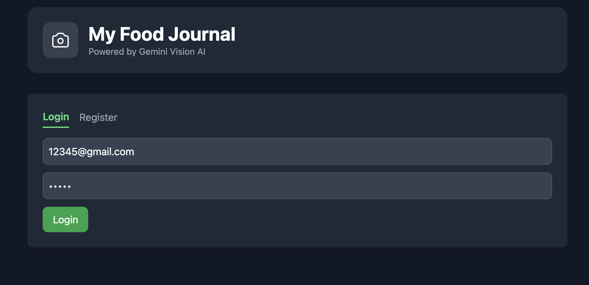
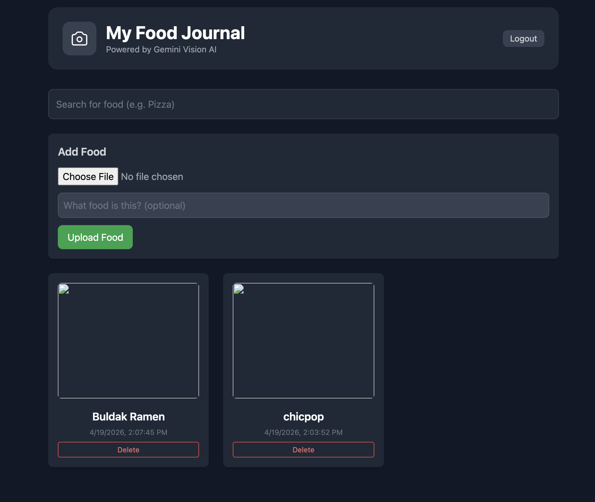

# My Food Journal

A full-stack AI-powered food journal that automatically identifies food from photos and estimates calories using Google Gemini Vision API.

**Live Demo:** https://food-recognition-app-7rtx.onrender.com




---

## Features

- **AI food recognition** — upload a photo and Gemini Vision identifies the food and estimates calories automatically
- **Korean / English language support** — AI responds in your selected language, saved per account
- **Calorie summary chart** — bar chart showing daily calorie totals for the past 7 or 30 days
- **JWT authentication** — register, login, private entries per user with bcrypt password hashing
- **Password change** — update your password from within the app
- **Daily journal view** — entries grouped by date with daily calorie totals
- **Real-time search** and paginated food entries
- **Delete with confirmation** — ownership enforced (can't delete other users' entries)
- **Mobile responsive** — sidebar with hamburger menu for small screens
- **Image storage on AWS S3** — uploaded images persist across deployments

## Tech Stack

| Layer | Technology |
|---|---|
| Backend | Python, FastAPI, SQLModel |
| Database | PostgreSQL (Supabase) |
| Auth | JWT (python-jose), bcrypt password hashing |
| Frontend | Vanilla JavaScript, Tailwind CSS, Chart.js |
| AI | Google Gemini Vision API |
| Storage | AWS S3 |
| Deployment | Render |

## Running Locally

```bash
git clone https://github.com/Sangha0822/food-recognition-app
cd food-recognition-app
python -m venv venv && source venv/bin/activate
pip install -r requirements.txt
```

Create a `.env` file:
```
SECRET_KEY=your-secret-key
GEMINI_API_KEY=your-gemini-api-key
DATABASE_URL=your-postgresql-connection-string
AWS_ACCESS_KEY_ID=your-aws-access-key
AWS_SECRET_ACCESS_KEY=your-aws-secret-key
AWS_REGION=your-aws-region
AWS_BUCKET_NAME=your-s3-bucket-name
```

```bash
uvicorn app.main:app --reload
```

Open `http://127.0.0.1:8000`

## Running Tests

```bash
pytest tests/ -v
```

13 tests covering auth, ownership enforcement, file validation, and language endpoints.
